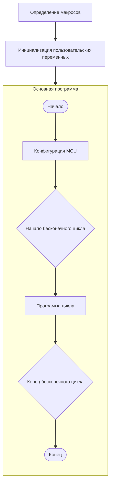
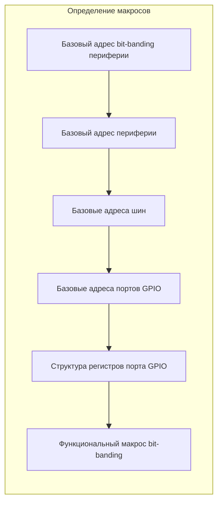
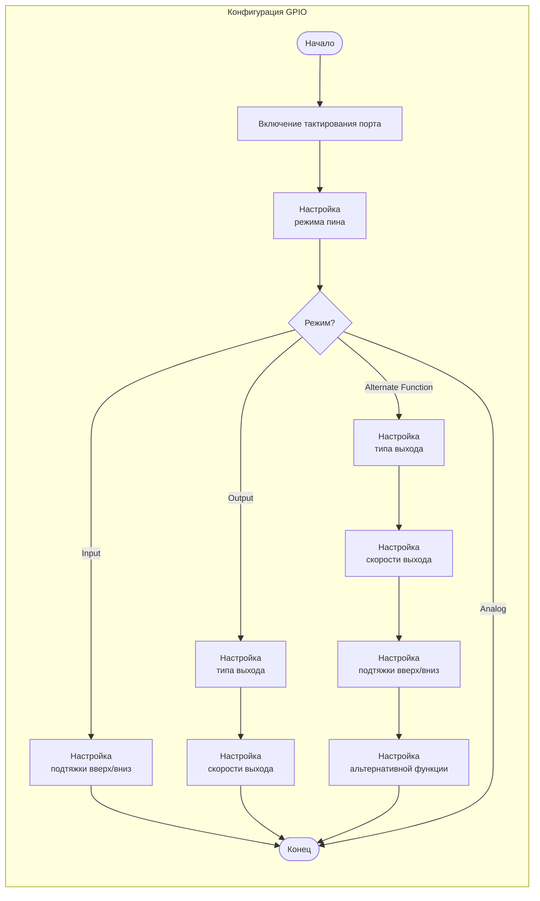

# Цель

- Ознакомление с документацией микроконтроллера (MCU)  
- Получение опыта работы с периферией GPIO

# Программное обеспечение

1. STM32CubeCLT
2. VS Code
3. Extensions for VSCode:
	- C/C++ Extension Pack
	- CMake
	- Cortex-Debug
	- Output Colorizer

# Аппаратное обеспечение

1. Лабораторный стенд

# Задание

## Часть I (онлайн)

| Режим         | Порт          | Пин          | Тип выхода    | Скорость      | Подтяжка    | Альтернативная функция |
| ------------- | ------------- | ------------ | ------------- | ------------- | ----------- | ---------------------- |
| Вход          | GPIOE   | 11   | -             | -             | NONE | -                      |
| Выход         | GPIOA  | 5  | OPEN_DRAIN | FAST | -           | -                      |
| Альт. функция | GPIOD   | 4   | OPEN_DRAIN  | MEDIUM  | UP | 4              |
| Аналоговый    | GPIOE | 12 | -             | -             | -           | -                      |

1. Настроить пины из таблицы выше в соответствии с заданными параметрами.  
2. Установить только пин, сконфигурированный как выход, используя регистр ODR.  
3. Сбросить только пин, сконфигурированный как выход, используя регистр BSRR.  
4. Считать состояние входного пина через регистр входных данных порта с маскированием нужного бита. Сохранить результат в глобальную переменную `read_val`.

## Часть II (офлайн)

## Предварительные действия

1. Открыть и изучить [схему лабораторного стенда](https://gitlab.vsmsrv.site/students/support/-/blob/main/Docs/Stand/stend_schematic.pdf).  
2. Найти две кнопки со встроенными светодиодами (красный, синий). Записать, к каким пинам MCU они подключены.  
3. По схеме кнопки определить логический уровень на пине MCU при нажатии и отпускании (active-high или active-low).  
4. Найти массив из 8 светодиодов и определить, какие пины MCU управляют каждым светодиодом.  

## Основная часть

1. Используя раздел Memory Map в [Datasheet](https://gitlab.vsmsrv.site/students/support/-/blob/main/Docs/MCU/DS10693.pdf) или [Reference Manual](https://gitlab.vsmsrv.site/students/support/-/blob/main/Docs/MCU/RM0390.pdf), определить базовые адреса GPIO-портов, подключённых к кнопкам и светодиодам.  
2. Создать структурированное отображение регистров GPIO с помощью `typedef`, как показано ниже (на основе карты регистров GPIO из  [Reference Manual](https://gitlab.vsmsrv.site/students/support/-/blob/main/Docs/MCU/RM0390.pdf)):
```
typedef struct  
{  
uint32_t FIRST_REGISTER,  
uint32_t NEXT_REGISTER,  
uint32_t NEXT_REGISTER,  
... ...  
uint32_t LAST_REGISTER,  
} GPIO_TypeDef;
```
3. 3. Включить тактирование соответствующего GPIO-порта:
```
*((uint32_t *) 0x40023830) |= 0xF;
```
4. Настроить режим работы каждого пина через регистры конфигурации режимов.  
5. Реализовать программу, которая считывает входные сигналы и управляет выходами согласно вашему варианту, используя соответствующие регистры данных.  

# Руководство

Перед написанием полной программы выполните следующие шаги:

1. Создайте минимальную программу для включения одного светодиода (проверка пина и управления выходом).  
2. Расширьте программу: переключение светодиода по нажатию кнопки (проверка чтения входа).  
3. Реализуйте полную логику согласно вашему варианту.  

Блок-схема рекомендуемой структуры программы:



Процесс определения макросов:



Конфигурация GPIO:



# Варианты

| Вариант | Метод управления выходом              | Метод чтения входа                   | Описание программы                                                                                                                                                                                                                                 |
| ------- | ------------------------------------- | ------------------------------------ | -------------------------------------------------------------------------------------------------------------------------------------------------------------------------------------------------------------------------------------------------- |
| 1       | Регистр выходных данных               | Регистр входных данных               | Светодиоды отображают двоичное представление числа (переменной). Нажатие кнопок увеличивает и уменьшает число:<br>синий: `00000001`<br>синий: `00000010`<br>синий: `00000011`<br>красный: `00000010`<br>красный: `00000001`<br>красный: `00000000` |
| 2       | Регистр установки/сброса битов (BSRR) | Регистр входных данных с bit-banding | Кнопки управляют перемещением одного горящего светодиода:<br>синий: `00000001`<br>синий: `00000010`<br>синий: `00000100`<br>красный: `00000010`<br>красный: `00000001`<br>красный: `10000000`                                                      |
| 3       | Регистр выходных данных с bit-banding | Регистр входных данных               | При нажатии кнопок светодиоды загораются последовательно:<br>синий: `00000001`<br>синий: `00000011`<br>синий: `00000111`<br>красный: `00000011`<br>красный: `00000001`<br>красный: `00000000`                                                      |
| 4       | Регистр выходных данных               | Регистр входных данных с bit-banding | При нажатии кнопок светодиоды загораются в комбинации:<br>синий: `00000001`<br>красный: `00000010`<br>красный: `00000100`<br>синий: `00001001`<br>синий: `00010011`<br>красный: `00100110`                                                         |
| 5       | Регистр установки/сброса битов (BSRR) | Регистр входных данных               | При нажатии синей кнопки отображается случайное число в двоичном виде. При нажатии красной кнопки все светодиоды выключаются.                                                                                                                      |
| 6       | Регистр выходных данных с bit-banding | Регистр входных данных с bit-banding | Светодиоды отображают двоичное представление числа (переменной). Нажатие кнопок увеличивает и уменьшает число:<br>синий: `00000001`<br>синий: `00000010`<br>синий: `00000011`<br>красный: `00000010`<br>красный: `00000001`<br>красный: `00000000` |
| 7       | Регистр выходных данных               | Регистр входных данных               | Кнопки управляют перемещением одного горящего светодиода:<br>синий: `00000001`<br>синий: `00000010`<br>синий: `00000100`<br>красный: `00000010`<br>красный: `00000001`<br>красный: `10000000`                                                      |
| 8       | Регистр установки/сброса битов (BSRR) | Регистр входных данных с bit-banding | При нажатии кнопок светодиоды загораются последовательно:<br>синий: `00000001`<br>синий: `00000011`<br>синий: `00000111`<br>красный: `00000011`<br>красный: `00000001`<br>красный: `00000000`                                                      |
| 9       | Регистр выходных данных с bit-banding | Регистр входных данных               | При нажатии кнопок светодиоды загораются в комбинации:<br>синий: `00000001`<br>красный: `00000010`<br>красный: `00000100`<br>синий: `00001001`<br>синий: `00010011`<br>красный: `00100110`                                                         |
| 10      | Регистр выходных данных               | Регистр входных данных с bit-banding | При нажатии синей кнопки отображается случайное число в двоичном виде. При нажатии красной кнопки все светодиоды выключаются.                                                                                                                      |
| 11      | Регистр установки/сброса битов (BSRR) | Регистр входных данных               | Светодиоды отображают двоичное представление числа (переменной). Нажатие кнопок увеличивает и уменьшает число:<br>синий: `00000001`<br>синий: `00000010`<br>синий: `00000011`<br>красный: `00000010`<br>красный: `00000001`<br>красный: `00000000` |
| 12      | Регистр выходных данных с bit-banding | Регистр входных данных с bit-banding | Кнопки управляют перемещением одного горящего светодиода:<br>синий: `00000001`<br>синий: `00000010`<br>синий: `00000100`<br>красный: `00000010`<br>красный: `00000001`<br>красный: `10000000`                                                      |
| 13      | Регистр выходных данных               | Регистр входных данных               | При нажатии кнопок светодиоды загораются последовательно:<br>синий: `00000001`<br>синий: `00000011`<br>синий: `00000111`<br>красный: `00000011`<br>красный: `00000001`<br>красный: `00000000`                                                      |
| 14      | Регистр установки/сброса битов (BSRR) | Регистр входных данных с bit-banding | При нажатии кнопок светодиоды загораются в комбинации:<br>синий: `00000001`<br>красный: `00000010`<br>красный: `00000100`<br>синий: `00001001`<br>синий: `00010011`<br>красный: `00100110`                                                         |
| 15      | Регистр выходных данных с bit-banding | Регистр входных данных               | При нажатии синей кнопки отображается случайное число в двоичном виде. При нажатии красной кнопки все светодиоды выключаются.                                                                                                                      |

# Вопросы

1. Как формируются адреса регистров периферии на основе карты памяти микроконтроллера?  
2. Сравните и проанализируйте различные методы работы с регистрами.  
3. Опишите принцип bit-banding и способ вычисления alias-адресов.  
4. Дайте определение GPIO и объясните его основные функции во встраиваемых системах.  
5. Какие уровни напряжения допустимы для GPIO-пинов в микроконтроллерах STM32?  
6. Перечислите основные режимы работы GPIO-пинов.  
7. Сравните различные методы управления выходами GPIO и укажите их преимущества и недостатки.  
8. Объясните разницу между конфигурациями выхода push-pull и open-drain.  
9. Каково назначение подтягивающих резисторов (pull-up и pull-down) в цифровых схемах?  
10. Что такое дребезг контактов и какие методы применяются для его подавления во встраиваемых системах?  
